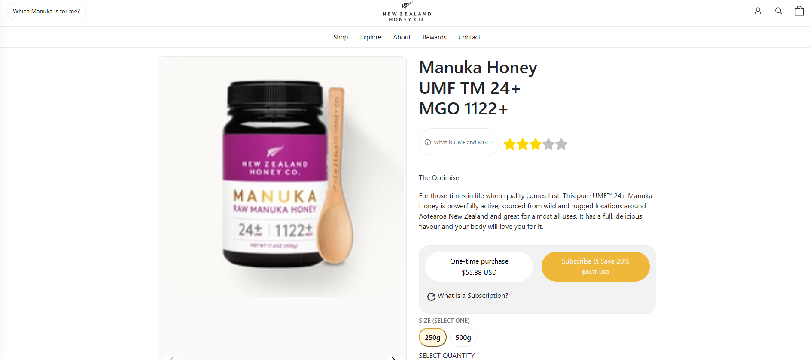
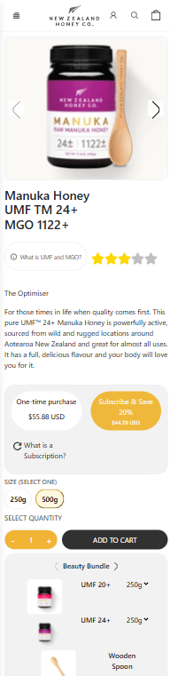

# 📖 README #

## 🐝 NZHC – Product Page Assignment ##

This project is my assignment of a responsive product detail page with an interactive buttons, UMF scale, taste profile slider.
I built it with React and made sure it works smoothly on both desktop and mobile.

---

## ⚡ How to Run It ##
```
npm install
npm start
```
That’s it — the app should spin up on http://localhost:3000.

---

## 🚀 Features ## 
1. Responsive Layout
 - Mobile-first design -> stacks sections vertically, optimized for touch
 - Desktop view -> product images and details side-by-side in a 2-column grid.
 - Navigation -> collapses into a hamburger menu on small screens
 - Consistent spacing % typography
2. Info Popover (YMF & MGO)
 - Click "What is UMF and MGO?" -> opens a popover
 - Desktop -> floating card
 - Mobile -> smooth bottom sheet with backdrop
 - Closes on Escape key, or close button.
 - NO layout shift (uses: position: fixed).
 - Accessibility -> ARIA roles, keyboard-friendly
3. Interactive Review
 - Click on the stars -> shows how many stars have you given
 - for both desktop, mobile
4. Quantity Selector
 - compact box [- 1 +] on desktop, mobile
 - controlled with useState hook.
 - Prevents going below 1.
5. UMF scale
 - Selectable spans (UMF™ 10+ … UMF™ 30+)
 - Active state styling 
 - Click to change active UMF value.
 - Designed to scale if more values are added
6. Taste Profile (Interactive Slider)
 - Gradient taste bar with a draggle marker
 - works with mouse and touch(mobile-friendly)
 - smoth transition, between 0-100%
 - marker position reflects taste intensity from clean & intense -> Bold & intense

---


**📸 Screenshots**






---

**📝 Final Notes**
I tried to think like an actual user - not just a developer. so this page:
- Works on mobile,
- looks clean,
- Interactive,
- And is accessible.
That's how I'd approach a production project too.

---
